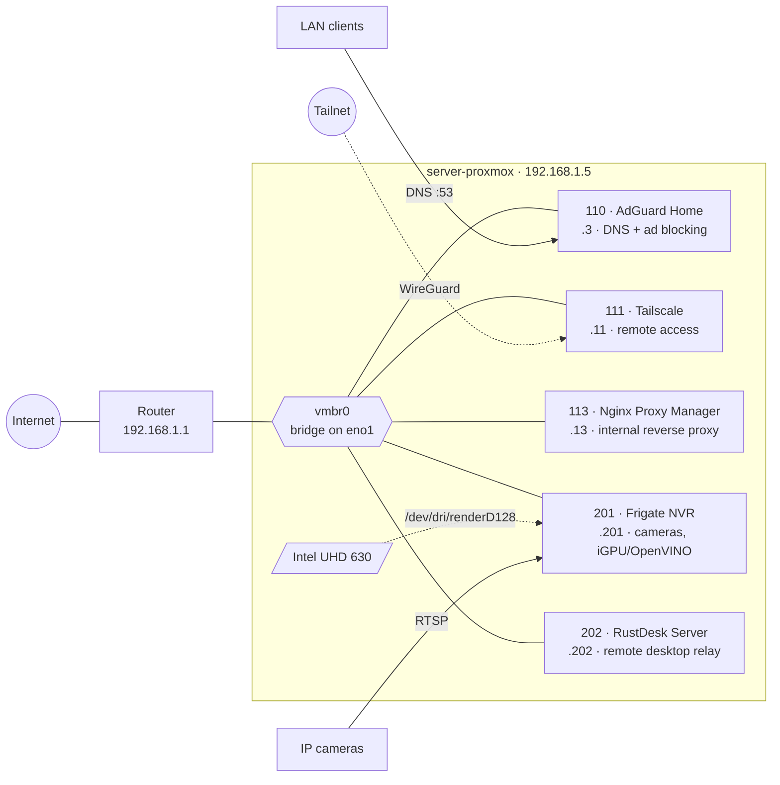

<p align="center">
  <picture>
    <source media="(prefers-color-scheme: dark)" srcset="docs/img/proxmox-logo-dark.png">
    
  </picture>
</p>

# Proxmox Homelab

Configuration for a single-node Proxmox VE host that runs the real
infrastructure of my home: ad-blocking DNS, security cameras, a reverse proxy
and remote access.

This repo tracks the state of the host and every guest so that changes are
reviewable, reversible and documented.

## Hardware

| | |
|---|---|
| CPU | Intel Core i5-9500 (6C/6T, VT-x, VT-d) |
| RAM | 16 GB DDR4 |
| Storage | 256 GB NVMe (WD SN530) — LVM + ext4, single disk |
| Network | 1× 1 GbE onboard |
| Hypervisor | Proxmox VE 9.2 on Debian 13 (trixie) |

## Architecture



## Services

| ID | Name | Role | Resources |
|---|---|---|---|
| 110 | `net-adguard` | DNS for the whole LAN with ad/tracker blocking | 1 vCPU · 1 GB · 6 GB |
| 111 | `net-tailscale` | VPN node for remote access to the LAN | 1 vCPU · 512 MB · 2 GB |
| 113 | `net-nginx-proxy-manager` | Reverse proxy for internal services | 2 vCPU · 2 GB · 8 GB |
| 201 | `app-frigate` | NVR with object detection on the iGPU (OpenVINO) | 2 vCPU · 2 GB · 32 + 64 GB media |
| 202 | `app-rustdeskserver` | Self-hosted RustDesk ID/relay server | 1 vCPU · 512 MB · 4 GB |

Naming: `net-*` for network plumbing, `app-*` for user-facing services.

## Repository layout

```
proxmox/
├── lxc/      # /etc/pve/lxc/<id>.conf — one file per container
└── host/     # network interfaces, storage.cfg, datacenter.cfg, fstab, pveversion
```

Files are exact copies of the host's configuration. Nothing here is applied
automatically yet.

## Decisions

- **LXC over VMs.** Every service is a Linux daemon that does not need its own
  kernel. Containers boot in seconds, share the host's memory efficiently and
  make the iGPU passthrough to Frigate a one-line `dev0:` entry instead of
  PCIe passthrough.
- **Unprivileged everywhere.** Root inside a container maps to an unprivileged
  UID on the host. The only exception is Tailscale, which needs `/dev/net/tun`
  bind-mounted — still unprivileged.
- **Static IPs in the guest config**, not DHCP reservations. The router is
  not something I control from a repo yet; `pct config` is.
